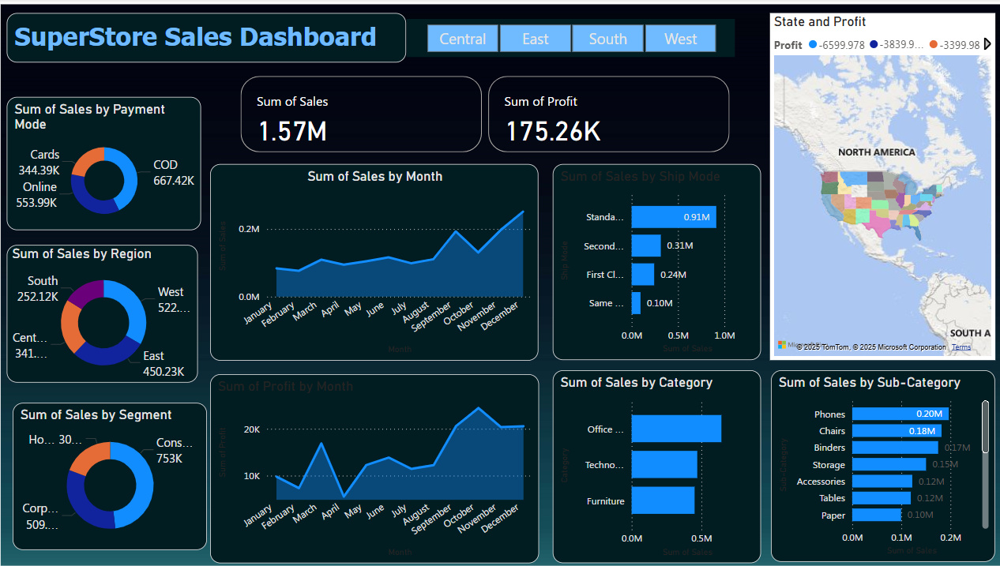

# superstore-powerbi-dashboard
Interactive sales dashboard built in Power BI using Superstore dataset

# 📊 SuperStore Sales Dashboard (Power BI)

This project is an interactive sales dashboard built using Power BI and the Superstore dataset.

## 📌 Features
- Region-wise and segment-wise sales analysis
- Sales & profit by category and sub-category
- Ship mode performance
- Time-based trends (month-wise sales/profit)
- Interactive slicers by Region and Category

## 🔧 Tools Used
- Power BI
- DAX (Data Analysis Expressions)
- Visualizations: Bar charts, Line charts, Maps, Donut charts

## 📁 Dataset
- Superstore Dataset (publicly available)

## 🧠 What I Learned
- Data modeling and relationship creation in Power BI
- Designing clean and interactive dashboards
- Using DAX for calculated columns and measures

## 📥 Download
You can download the `.pbix` file and explore the dashboard:  
👉 [Download Dashboard](superstore_dashboard.pbix)

---

## 📬 Connect With Me
- [LinkedIn](https://www.linkedin.com/in/aarya-gawade-dec1512)
